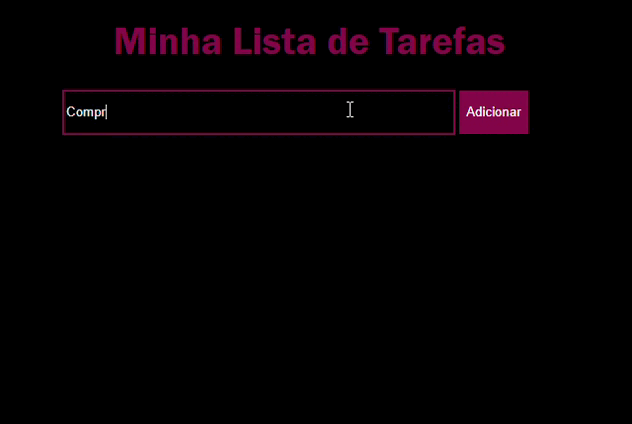

# ✅ To_Do_List

*[🇧🇷 Português](#-português) | [🇺🇸 English](#-english)*

---

## 🇧🇷 Português

> Um gerenciador de tarefas simples e eficiente, desenvolvido para consolidar conceitos de estrutura de dados, lógica de programação e organização de rotina.

🔗 **[Acesse o projeto aqui](https://menunes-cs.github.io/To_Do_List/)**

### 📋 Sobre o projeto

Este projeto foi criado com o objetivo de praticar e aplicar conceitos fundamentais de desenvolvimento web, unindo lógica de programação com uma ferramenta útil para o dia a dia: um sistema de organização de tarefas.

### ⚙️ Funcionalidades

- Adicionar novas tarefas
- Marcar tarefas como concluídas
- Remover tarefas da lista
- Interface simples e intuitiva

### 🛠️ Tecnologias utilizadas

- HTML5
- CSS3
- JavaScript

### 🚀 Como executar o projeto

1. Clone este repositório
2. Abra o arquivo `index.html` no navegador

Ou acesse diretamente pela versão online: [https://menunes-cs.github.io/To_Do_List/](https://menunes-cs.github.io/To_Do_List/)

---

## 🇺🇸 English

> A simple and efficient task manager, built to consolidate concepts of data structures, programming logic, and routine organization.

🔗 **[Access the project here](https://menunes-cs.github.io/To_Do_List/)**

### 📋 About the project

This project was created to practice and apply fundamental web development concepts, combining programming logic with a useful everyday tool: a task organization system.

### ⚙️ Features

- Add new tasks
- Mark tasks as completed
- Remove tasks from the list
- Simple and intuitive interface

### 🛠️ Technologies used

- HTML5
- CSS3
- JavaScript

### 🚀 How to run the project

1. Clone this repository
2. Open the `index.html` file in your browser

Or access it directly through the live version: [https://menunes-cs.github.io/To_Do_List/](https://menunes-cs.github.io/To_Do_List/)

